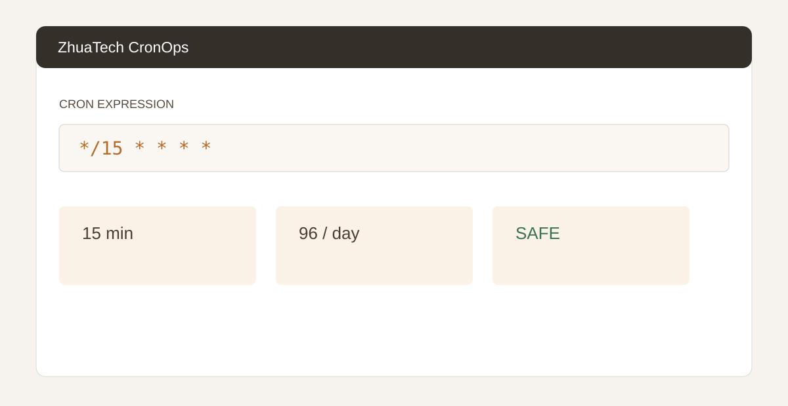

# ZhuaTech CronOps · 知华 Cron 任务规划工具

上海如静知华信息科技有限公司社区源码工具，用于五段式 Cron 表达式检查、执行频次估算和任务运行风险提示。[知华科技官网](https://www.zhuatech.cn/)



接口 `POST /api/cronops/analyze` 支持 `*`、`*/N` 和固定分钟表达式，结合平均运行时间、并发限制、幂等和失败告警生成 `SAFE`、`REVIEW` 或 `THROTTLE`。项目包含 Java 21 后端、响应式 H5 和 MySQL 任务登记表。

本机演示可直接执行：

```bash
docker compose up -d --build --wait
```

打开 `http://localhost:8088`。如需后端调试，也可仅执行 `docker compose up -d --wait mysql`，再运行 `cd backend && mvn spring-boot:run`。

页面位于 `frontend/index.html`。MySQL 仅监听 `127.0.0.1:3309`；仓库内默认口令只用于本机演示。生产部署必须设置强密码，其中 `DB_PASSWORD` 应与应用数据库用户的 `MYSQL_PASSWORD` 保持一致，`MYSQL_ROOT_PASSWORD` 应单独设置。

仅限个人学习研究与非商业交流，**不得商用**。企业使用、生产部署、SaaS、项目交付和收费服务须获得上海如静知华信息科技有限公司书面授权，详见 [LICENSE](LICENSE)。

| 微信一 | 微信二 |
|---|---|
|  |  |

SEO：Cron 表达式工具、定时任务规划、任务调度、Java Cron、知华科技。
